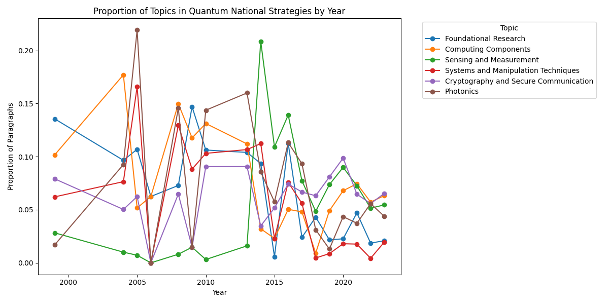
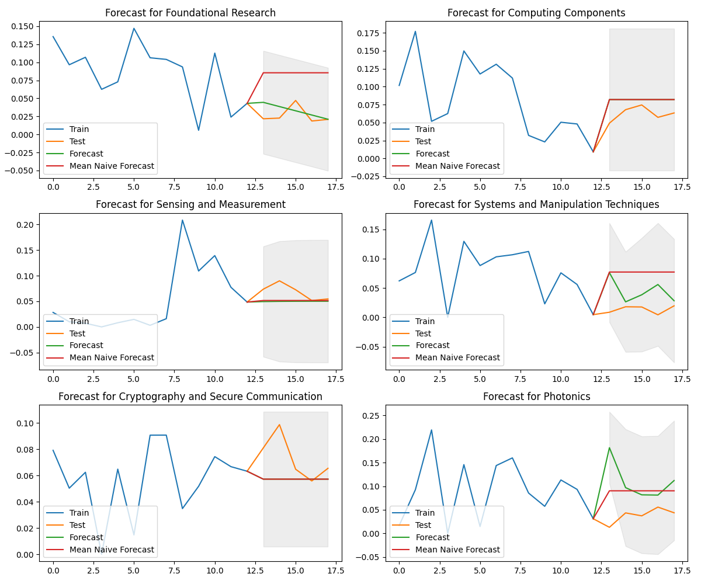

# Forecasting Quantum Physics Research Trends using National Quantum Strategies

*Data Science, Prediction, and Forecasting (F24)*
*Aarhus University, Cognitive Science MSc.*

---

## Overview

This project aims to enable forecast of research trends within quantum physics by analyzing national quantum strategies—documents in which countries outline their quantum research agendas over the past 20 years. The analysis identifies key research topics within these strategies using `BERTopic`, a state-of-the-art topic modeling technique, and forecasts their prominence over time using `ARIMA` models.

Specifically, the project identifies the following research topics within national quantum strategies: *Foundational Research*, *Quantum Computing Components*, *Sensing and Measurement*, *Systems and Manipulation Techniques*, *Cryptography* and *Photonics* and how they have evolved from 1999 to 2023.



Finally, an ARIMA model is fitted to each topic to forecast its prominence over time. The model is evaluated using the Root Mean Squared Error (RMSE) and Mean Absolute Error (MAE) metrics.



## Repository Structure

├── data/
│   ├── df_full.csv # Complete dataset (available upon request)
│   ├── manual_fix.csv # Dataset with hand-picked rows for manual filtering during cleaning
├── models/
│   ├── model_summary_[topic].txt # ARIMA model summaries for each topic analyzed
├── documents/
│   ├── australia_2019.pdf # Original documents used for analysis
│   ├── australia_2022.pdf # 62 documents in total
│   ├── ...
├── plots/
│   ├── pacf_all_topics.png # PACF plots for each topic
│   ├── proportion_per_topic_per_year.png # Proportion of topics over time
│   ├── forecast_[topic].png # Forecast plot for each topic
│   ├── all_forecasts.png # Combined forecast plots for all topics
├── results/
│   └── results.csv # RMSE and MAE metrics for ARIMA and Naive Mean Models
├── src/
│   ├── data_cleaning.py # Script for data cleaning and preprocessing
│   ├── topic_modeling.py # Script for topic modeling using BERTopic
│   ├── p_and_d_determination.py # Script for determining p and d values for ARIMA models
│   ├── fit_arima.py # Script for fitting ARIMA models and generating forecasts
│   └── README.md # Further description of the scripts in this folder
├── .gitignore # Files and directories to be ignored by Git
├── requirements.txt # List of Python packages required for the project
├── setup.sh # Script to set up the virtual environment and install dependencies
├── LICENSE # License information for the project
└── README.md # Project overview and instructions

## Getting Started

### Prerequisites

To run the code in this repository, you'll need the following installed:

- Python 3.9 or higher

### Setup

1. **Clone the repository**:
   ```bash
   git clone https://github.com/sashapustota/forecasting-topics
   cd forecasting-topics
   ```

2. **Set up the virtual environment:**
    Run the setup.sh script to create a virtual environment and install the required dependencies:
    ```bash
    bash setup.sh
    ```

3. **Activate the virtual environment:**
    ```bash
    source ./forecasting-topics-venv/bin/activate
    ```

4. **Run the scripts:**
    You can now run the scripts in the `src/` directory to clean the data, perform topic modeling, determine the p and d values for ARIMA models, fit ARIMA models, and generate forecasts. For detailed descriptions of the scripts, refer to the `README.md` file in the `src/` directory.

## License

This project is licensed under the Apache License 2.0 - see the [LICENSE](LICENSE) file for details.